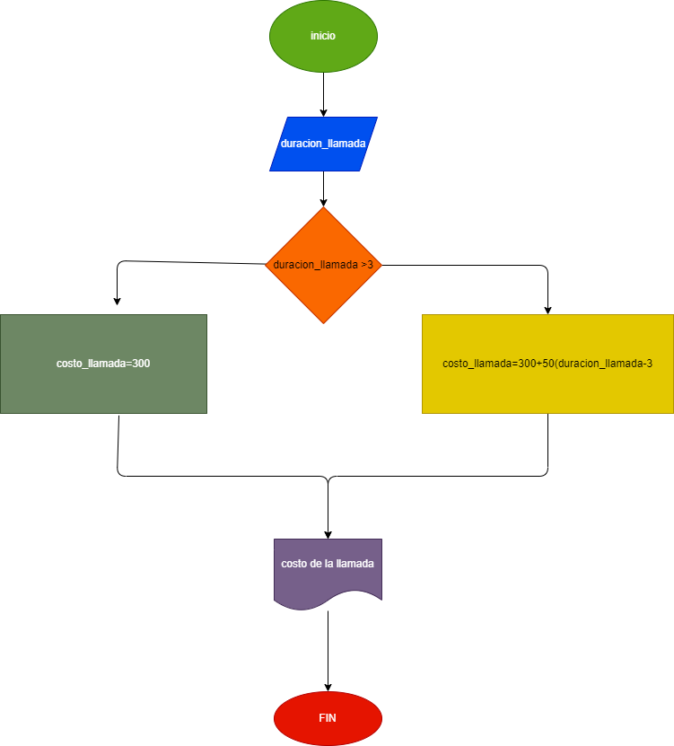

# ejercicio 1

# 1. Ingresar el tiempo de duración de una llamada telefónica y determinar la cantidad a pagar, de acuerdo con lo siguiente:
# a.Toda llamada que dure tres minutos o menos tienen un costo de $300.
# b. Cada minuto adicional cuesta $50.

